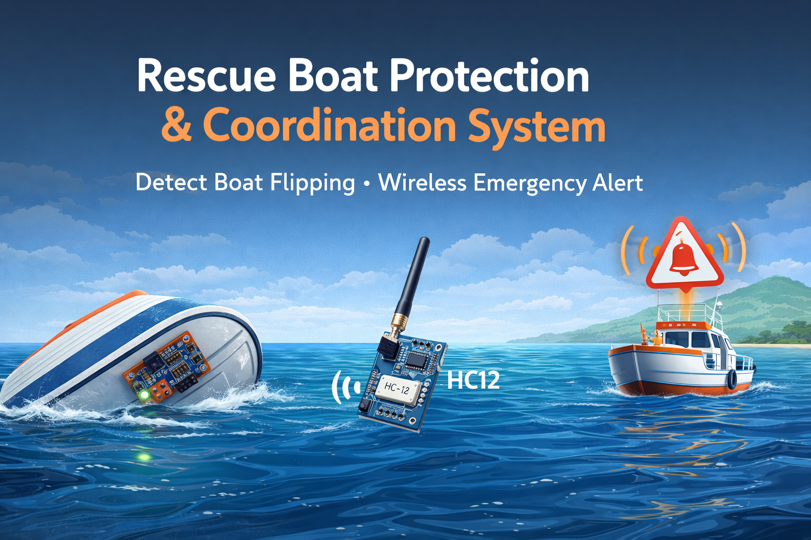

  

# 🚤 Rescue Boat Protection and Emergency Coordination System

### Embedded Wireless Safety System for Boat Accident Detection

---

## 📌 Overview

This project implements a wireless safety and coordination system for boats using motion sensors, microcontroller processing, and RF communication.

When a boat flip is detected, an emergency signal is transmitted to nearby boats to provide real-time warning and coordination.

---

## ✨ Features

* Boat flip detection using MPU6050
* Wireless emergency alert using HC12
* GPS location sharing using NEO-6M
* Bluetooth monitoring using HC05
* Multi-boat communication
* Embedded microcontroller control
* Real-time warning system
* Expandable architecture

---

## 🔧 Hardware Used

* ATmega328P / Arduino / ESP32
* HC12 Wireless Transceiver
* HC05 Bluetooth Module
* NEO-6M GPS Module
* MPU6050 Accelerometer & Gyroscope
* Buzzer / LED alert
* Voltage regulator
* Power supply module

---

## 📡 Communication Module

The system was initially designed using LoRa SX1278, but due to configuration complexity and unstable communication during testing, the module was replaced with HC12 transceiver.

HC12 provides:

* Simple UART communication
* Easy configuration
* Stable wireless connection
* Suitable range for boat coordination
* Fast hardware implementation

---

## ⚙️ Working Principle

1. MPU6050 detects abnormal tilt
2. Microcontroller processes sensor data
3. GPS module gets location
4. HC12 sends emergency signal
5. Nearby boats receive alert
6. HC05 used for local monitoring
7. Buzzer / LED activated

---

## 📂 Repository Structure

Docs → Project documents
Simulations → Circuit design files
coding → Embedded programs
esp32/lora → Communication test codes
images → Project images
.idea → IDE files

---

## 🌊 Applications

* Fishing boat safety system
* Rescue boat coordination
* Marine accident alert system
* Small vessel monitoring
* Coastal safety projects

---

## 🚀 Future Improvements

* LoRa mesh network
* GSM / LTE alert system
* Base station monitoring
* Mobile application
* AI-based accident detection

---

## 📜 License

This project is for educational and research purposes.
